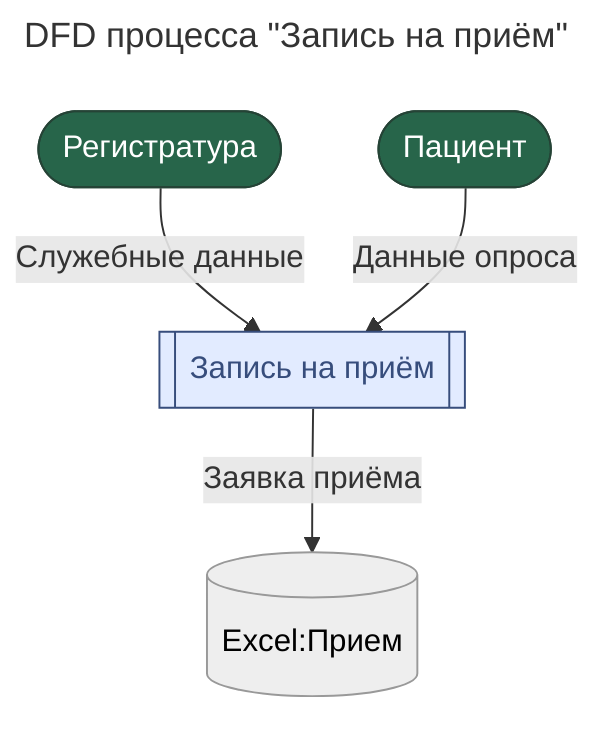
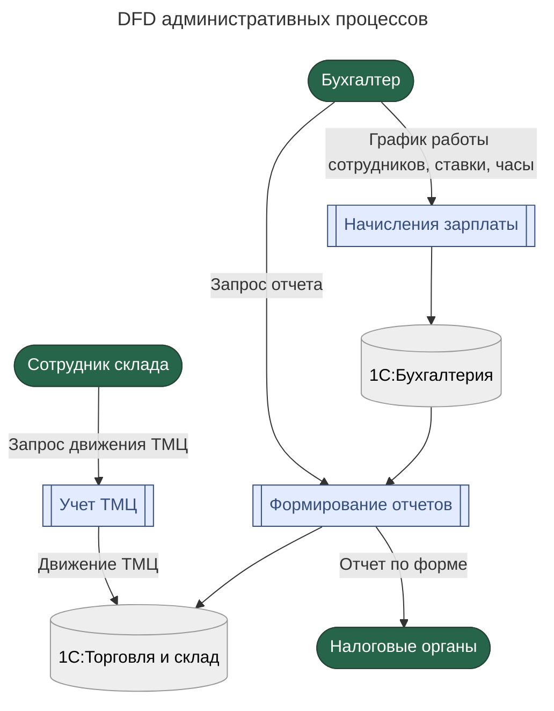
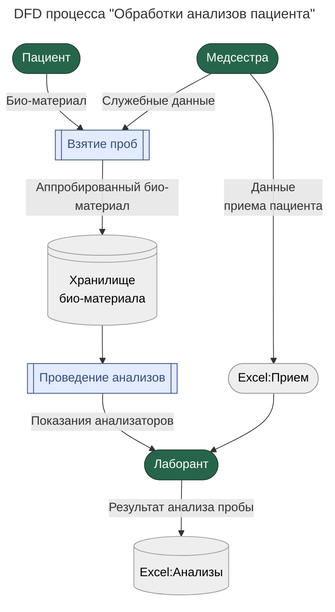
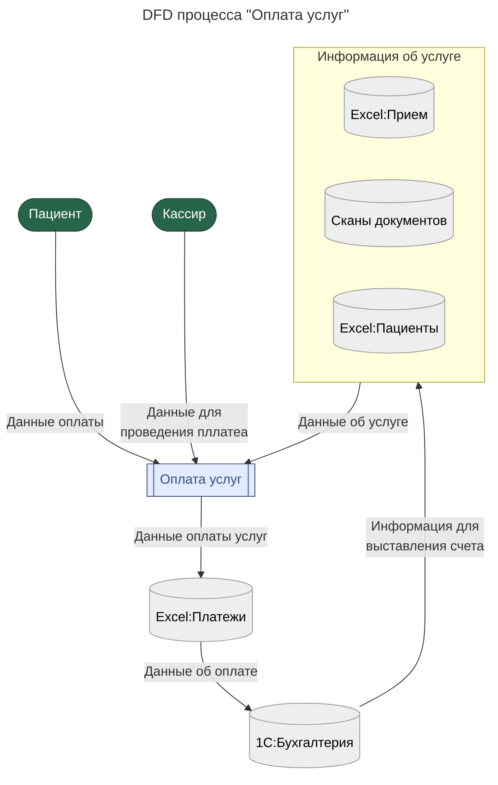
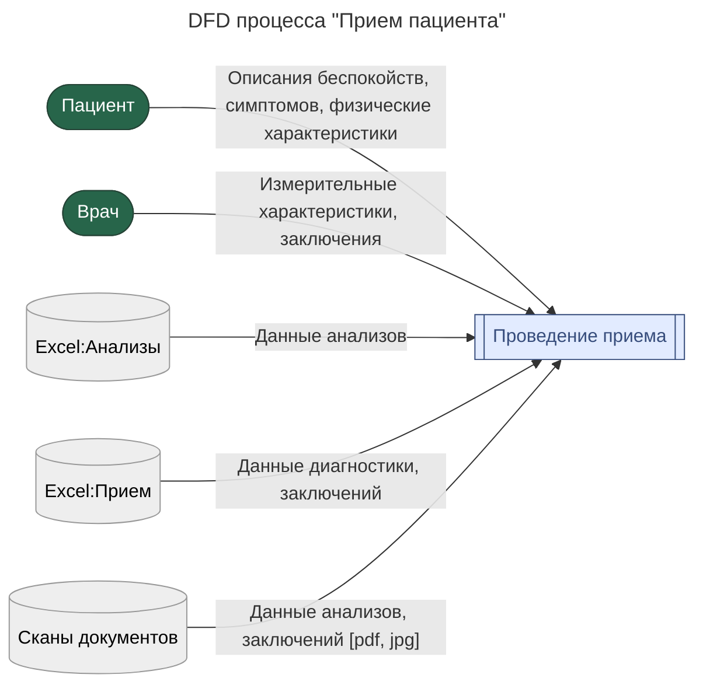

# Движение данных компании Медикаменте
>Data flow diagrams

---

## Запись на приём

---

## Административные процессы

---

## Обработка анализов

---

## Оплата услуг

---

## Прием пациента

---

# Рекомендации по внедрению архитектуры безопасности процессов компании

| **Процесс**             | **Меры защиты данных**                                                                   | **Архитектурные решения**                                                              |
| ----------------------- | ---------------------------------------------------------------------------------------- | -------------------------------------------------------------------------------------- |
| **Регистрация**         | - Шифрование персональных данных (PII) как при передаче, так и при хранении.             | - REST API с аутентификацией на основе OAuth 2.0 или JWT.                              |
|                         | - Валидация входных данных (email, телефон и др.).                                       | - Использование СУБД с поддержкой ролевого доступа (например, PostgreSQL или MS SQL).  |
|                         | - Доступ к данным ограничен: только ресепшен и лечащие врачи по принципу необходимости.  | - Ведение аудит-логов всех операций с персональными данными.                           |
| **Запись на приём**     | - Обязательное использование HTTPS/TLS для защиты от перехвата.                          | - Архитектура на основе событий (Kafka/RabbitMQ) для уведомлений о новых записях.      |
|                         | - Проверка прав доступа перед просмотром расписания врачей.                              | - Кэширование расписания через Redis для повышения производительности.                 |
| **Проведение приёма**   | - Строгий контроль доступа к медкартам (RBAC, соответствие HIPAA/GDPR).                  | - Микросервисный подход: разделение логики по типам данных (медкарты, анализы и т.д.). |
|                         | - Защита записей от несанкционированного изменения (например, цифровые подписи).         | - Хранение сканов и документов в защищённом объектном хранилище (S3 с шифрованием).    |
| **Взятие проб**         | - Применение уникальных идентификаторов (штрихкоды/QR-коды) для исключения путаницы.     | - Интеграция с лабораториями через стандартизированные API (HL7/FHIR).                 |
|                         | - Ограничение просмотра результатов анализов только авторизованным персоналом.           | - Асинхронная обработка задач через очереди (например, Celery).                        |
| **Оплата услуг**        | - Соответствие PCI DSS: платёжные данные не хранятся напрямую, используется токенизация. | - Выделенный микросервис для платежей с API-шлюзом (Kong, Apigee).                     |
|                         | - Обязательная двухфакторная аутентификация для сотрудников кассы.                       | - Надёжная репликация платёжных данных из PostgreSQL в 1С с подтверждением доставки.   |
| **Начисление зарплаты** | - Защита персональных данных сотрудников в соответствии с GDPR.                          | - Безопасная интеграция с 1С через mTLS.                                               |
|                         | - Обеспечение целостности данных через хеширование критически важных полей.              | - Автоматизация расчётов с помощью планировщика задач (например, Apache Airflow).      |

**Общие принципы, применимые ко всем процессам**

1. **Информационная безопасность**  
   - Шифрование данных как в состоянии покоя, так и при передаче (AES-256, TLS 1.2+).  
   - Гибкая модель доступа: комбинация ролевой модели (AD/LDAP) и атрибутивного контроля (ABAC) для медкарт.  
   - Полный аудит действий пользователей с интеграцией в SIEM-системы.

2. **Архитектурная устойчивость**  
   - Чёткое разделение доменов: медицинские, финансовые и кадровые данные хранятся и обрабатываются раздельно.  
   - Резервирование: репликация баз данных и географически распределённое хранение.  
   - Поддержка горизонтального масштабирования stateless-компонентов через Kubernetes.

**Особенности работы с медицинскими данными**

- Результаты анализов и назначения должны храниться **только в сертифицированных системах**, соответствующих требованиям здравоохранения.  
- Доступ врачей к конфиденциальной информации возможен **только через защищённые каналы**: корпоративная сеть или VPN с политиками Zero Trust.

---

# Риски в IT-ландшефте Медикаменте

#### **1. Управление данными**
- Данные фрагментированы: пациенты, финансы, ТМЦ и записи хранятся в Excel, 1С и PDF без единой точки управления.  
- Отсутствует централизованная база данных → дублирование, потеря информации, сложность аналитики.  
- Зависимость от ручного ввода → высокая вероятность ошибок и пропусков.  
- Сканы документов (PDF/JPG) неструктурированы → невозможность автоматической обработки.

#### **2. Безопасность и доступ**
- Нет системы управления доступом: файлы на общем диске открыты для всех.  
- Персональные и медицинские данные не шифруются → высокий риск утечки.  
- Отсутствует аудит изменений → невозможно установить источник ошибки или нарушения.  
- Сотрудники могут свободно копировать, изменять или удалять данные → внутренние угрозы.

#### **3. Бизнес-процессы**
- Запись на приём осуществляется вручную → возможны коллизии и перегрузка ресепшена.  
- Платежи дублируются в Excel и 1С → избыточная работа и риск расхождений.  
- Отсутствует синхронизация между системами → требуется ручная сверка.  
- Нет самообслуживания для пациентов → зависимость от администратора.

#### **4. Техническая инфраструктура**
- Все сервисы работают на одном физическом сервере → единая точка отказа.  
- Резервное копирование не настроено → потеря данных может быть необратимой.  
- Отказ от облачных технологий → сложность при открытии новых филиалов.  
- Нет механизмов отказоустойчивости (репликация, кластеризация).

#### **5. Аналитика и управление**
- Отчёты формируются вручную → медленно, субъективно, подвержены ошибкам.  
- Отсутствуют BI-инструменты → невозможно строить прогнозы или оценивать эффективность.  
- Руководство лишено оперативной видимости KPI → принятие решений «вслепую».

#### **6. Соответствие законодательству**
- Система не соответствует GDPR и HIPAA → риск штрафов при проверках.  
- Не определены политики хранения данных → неясно, как долго хранить сканы, логи, платёжные истории.  
- Отсутствие документированных процедур защиты → юридическая уязвимость.

