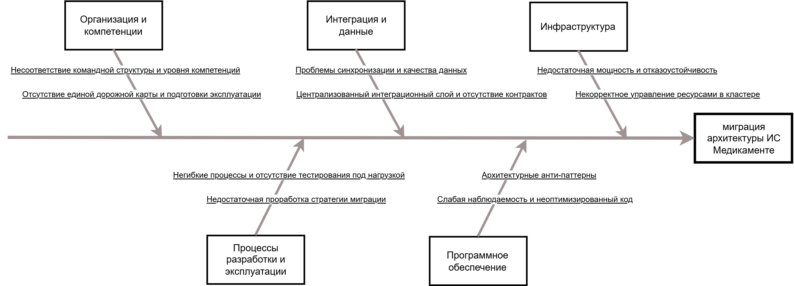

---
aliases:
---

---

# Оценка узких мест при миграции архитектуры ИС Медикаменте

## 1. Контекст и цели миграции

«Медикаменте» — медицинская организация, ведущая учёт пациентов, записей, платежей и медкарт в Excel и сканах на общем диске, а финансы и ТМЦ — в «1С». С ростом сети клиник и клиентской базы возникает необходимость перехода к масштабируемой, безопасной и автоматизированной системе.

Цели миграции:
- заменить ручные процессы единой цифровой платформой;
- обеспечить горизонтальное масштабирование под новые филиалы;
- усилить защиту медицинских данных;
- сократить время вывода новых функций (портал, мобильное приложение, интеграция с лабораториями).

Планируется переход от децентрализованного монолита к микросервисной архитектуре с контейнеризацией, оркестрацией и событийной интеграцией.

Ключевая проблема для анализа:

> **Риск деградации производительности и надёжности при миграции на микросервисную архитектуру.**

## 2. [Диаграмма Исикавы](ishikawa-migration-concept.drawio.png)

Анализ проведён по пяти ключевым направлениям:
1. Инфраструктура  
2. Программное обеспечение  
3. Интеграция и данные  
4. Процессы разработки и эксплуатации  
5. Организация и компетенции

## 3. Потенциальные узкие места по категориям

### 3.1. Инфраструктура

**3.1.1. Недостаточная мощность и отказоустойчивость**  
Текущая инфраструктура не рассчитана на многократный рост нагрузки. Отсутствие репликации БД, кластеризации сервисов и резервирования сетевых каналов создаёт единую точку отказа. Задержки между филиалами могут критично влиять на синхронные операции.

**3.1.2. Некорректное управление ресурсами в кластере**  
Без настройки лимитов, проб и автоскейлинга в Kubernetes возможны конфликты за ресурсы («шумные соседи»), флаппинг подов и лавинообразные сбои под нагрузкой.

### 3.2. Программное обеспечение

**3.2.1. Архитектурные анти-паттерны**  
Сохранение общей монолитной БД и синхронные цепочки вызовов между сервисами нарушают принципы микросервисов. Это приводит к блокировкам, каскадным отказам и невозможности независимых релизов.

**3.2.2. Слабая наблюдаемость и неоптимизированный код**  
Отсутствие распределённых трассировок, централизованных логов и ключевых метрик затрудняет диагностику. Унаследованные тяжёлые SQL-запросы без индексов и пагинации быстро становятся узким местом.

### 3.3. Интеграция и данные

**3.3.1. Проблемы синхронизации и качества данных**  
Параллельная работа старой и новой систем без чёткого источника правды ведёт к рассогласованию данных. Несовместимость форматов 1С/Excel с доменными моделями требует сложных ETL-преобразований.

**3.3.2. Централизованный интеграционный слой и отсутствие контрактов**  
Единый «толстый» шлюз становится новым монолитом. При этом отсутствие контрактного тестирования API делает интеграции хрупкими — любое изменение интерфейса может нарушить работу.

### 3.4. Процессы разработки и эксплуатации

**3.4.1. Негибкие процессы и отсутствие тестирования под нагрузкой**  
Крупные релизы раз в несколько месяцев, ручные этапы деплоя и отсутствие регулярных нагрузочных/chaos-тестов не позволяют гарантировать стабильность новой архитектуры.

**3.4.2. Недостаточная проработка стратегии миграции**  
Отсутствие поэтапного плана с механизмами отката и постепенного переключения трафика повышает риски при переходе на новую систему.

### 3.5. Организация и компетенции

**3.5.1. Несоответствие командной структуры и уровня компетенций**  
Команды разделены по техническим слоям, а не по бизнес-доменам, что усиливает разрывы в коммуникации. При этом у сотрудников недостаточно опыта в облачных технологиях, observability и event-driven архитектуре.

**3.5.2. Отсутствие единой дорожной карты и подготовки эксплуатации**  
Нет согласованного приоритета миграции доменов, а службы поддержки не обучены работе с распределёнными системами — это увеличивает MTTR и снижает устойчивость.

## 4. Рекомендации по устранению узких мест и приоритеты

### 4.1. Инфраструктура

**4.1.1. Провести capacity planning и обеспечить отказоустойчивость**  
Смоделировать пиковые нагрузки, внедрить репликацию БД, кластеризацию и тестирование failover. Настроить HPA, liveness/readiness-пробы и изоляцию ресурсов в Kubernetes.  
→ **Приоритет: высокий**

### 4.2. Программное обеспечение

**4.2.1. Реализовать чистую микросервисную архитектуру**  
Разделить монолитную БД по доменам, перейти на событийную интеграцию, устранить синхронные цепочки. Внедрить observability «из коробки» и оптимизировать тяжёлые запросы.  
→ **Приоритет: высокий**

### 4.3. Интеграция и данные

**4.3.1. Обеспечить надёжную синхронизацию и контрактную стабильность**  
Запустить Parallel Run с чётким определением источника правды. Использовать события для междоменного взаимодействия. Ввести контрактное тестирование в CI/CD.  
→ **Приоритет: высокий**

### 4.4. Процессы разработки и эксплуатации

**4.4.1. Автоматизировать и ускорить доставку изменений**  
Перейти к частым малым релизам, внедрить DORA-метрики, настроить регулярные нагрузочные тесты и формализовать план миграции с возможностью отката.  
→ **Приоритет: высокий**

### 4.5. Организация и компетенции

**4.5.1. Выстроить команды вокруг доменов и закрыть компетенции**  
Сформировать кросс-функциональные команды по бизнес-направлениям. Провести обучение по микросервисам, Kubernetes и observability. Утвердить единую дорожную карту миграции.  
→ **Приоритет: высокий**
